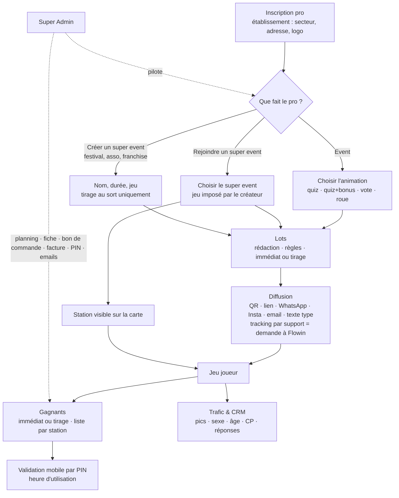

# Référentiel fonctionnel Flowin — point de référence pour audit et correction

Rédigé par Romain le 16/09/2026, rangé tel quel. **Toute correction, tout nouvel écran se mesure à ce document.**
Audit du 16/09 : section 5. Ordre de correction : section 6. Corrections faites le 16/09 : section 7.

---

## 1. EVENT — le pro individuel

**Personae** : commerce, organisation, institution.

### 1.1 Inscription et gestion
- Coordonnées de l'établissement : secteur d'activité, adresse.
- Choix d'une animation : quiz · quiz + questions bonus · vote · roue (spin).

### 1.2 Gestion des lots
- Sélection ou rédaction des lots offerts + règles d'utilisation.
- Distribution : gain immédiat, ou après tirage au sort.
- Liste des gagnants et utilisation des lots (quel lot a été utilisé, à quelle heure).
- Validation des lots sur mobile par code PIN.

### 1.3 Gestion des publications
- Publication du jeu : email, WhatsApp, Instagram.
- Texte type de l'event (« nous sommes heureux de… ») + lien à cliquer.
- QR code de l'event, qui donne accès au jeu.
- QR code de tracking par support : sur demande de validation à Flowin.
- Email prérempli (lien Gmail), Mailchimp pour la multi-publication.

### 1.4 Trafic et data
- Constitution du CRM.
- Pics de fréquentation.
- Répartition sexe, âge, code postal.
- Réponses aux questions par participant + statistiques.

---

## 2. SUPER EVENT

**Personae** : festival, association de commerçants, tête de franchise, groupement.

### 2.1 Cas 1 — le pro intègre un super event
- Le pro choisit un super event et s'y inscrit.
- Le jeu est **déjà choisi en amont par le créateur** du super event ; le pro apparaît sur la carte comme station de jeu active.
- QR code de sa station, pour publier, imprimer, diffuser. Lien de tracking unique : sur demande à Flowin (onboarding).
- Lots, règles de diffusion, liste des gagnants : **comme pour un event**.
- Diffusion : **comme pour un event**. Seule différence : être visible sur la carte.
- Trafic global et par station de jeu.

### 2.2 Cas 2 — créer un super event
- Même processus que créer un event (nom, durée…).
- Choix du jeu.
- **Super event : tirage au sort uniquement.**
- Liste des gagnants regroupée par station ; email prérempli **au nom du super event**, comme pour un event.

---

## 3. SUPER ADMIN (SA)

- Créer et supprimer : pros, events, super events.
- Planning des events et super events : QR code utilisé, event / super event, date, enseigne, nom de l'event.
- Accès total aux comptes pro : contenu, trafic, infos, liste des gagnants, trafic des utilisateurs.
- Fiche complète, bon de commande et facturation **par event, super event, date**.
- Par event / super event : QR code, lots en stock, règles de diffusion, code PIN de validation, envoi d'email depuis la fiche pro.

---

## 4. Carte du fonctionnement, vue par le pro

---

## 5. Audit — chaque requête : état et correction proposée

✅ fonctionne · 🟡 partiel · ❌ absent

### Event

| # | Requête | État | Constat | Correction proposée |
|---|---|---|---|---|
| 1 | Coordonnées de l'établissement (secteur, adresse) | ✅ | saisies à l'inscription, plus modifiables ensuite | rendre « Mon entreprise » modifiable — **fait (lot 7)** |
| 2 | Animation quiz | ✅ | une banque de questions au choix | — |
| 3 | Animation quiz + questions bonus | ✅ | pas de choix de banque bonus | ajouter le choix de la banque bonus dans « Créer mon animation » — **fait (lot 2)** |
| 4 | Animation vote | ✅ | créée sans éléments à voter | ajouter la saisie des éléments (écran déjà existant côté SA) — **fait (lot 2)** |
| 5 | Animation roue | ✅ | créée sans segments | ajouter la saisie des segments (écran déjà existant côté SA) — **fait (lot 2)** |
| 6 | Sélection ou rédaction des lots | ✅ | rédaction seulement | proposer aussi les lots déjà créés par le pro — **fait (lot 3)** |
| 7 | Règles d'utilisation des lots | ✅ | champ conditions | — |
| 8 | Distribution : gain immédiat / après tirage | ✅ | choix enregistré, jamais appliqué par les jeux | faire appliquer le choix par les jeux (touche les modules quiz et roue : ton accord requis) — **fait (lot 2)** |
| 9 | Liste des gagnants | ✅ | par opération | — |
| 10 | Lot utilisé, à quelle heure | ✅ | lot oui, heure non affichée | afficher date + heure de remise sur chaque gagnant — **fait (lot 3)** |
| 11 | Validation mobile par code PIN | ✅ | fonctionne ; textes NDS en dur sur le billet ; pas de PIN pour un pro sans fiche commerce | billet aux textes de l'opération ; PIN rattaché au pro — **fait (lot 3)** |
| 12 | Publication par email | ✅ | Gmail seulement en fin de création, sans lien | bouton email prérempli (texte + lien) dans « Emails & com » — **fait (lot 4)** |
| 13 | Publication WhatsApp | ✅ | | — |
| 14 | Publication Instagram | ✅ | | bouton « copier le texte + télécharger le visuel QR » — **fait (lot 4)** |
| 15 | Texte type « nous sommes heureux… » + lien | ✅ | | texte prérempli modifiable (nom, dates, lot, lien), réutilisé par email / WhatsApp / Instagram — **fait (lot 4)** |
| 16 | QR code de l'event | ✅ | PNG, SVG, affiche A4 | — |
| 17 | QR tracking par support, sur demande à Flowin | ✅ | demande enregistrée, aucun retour au pro | bouton « demander un QR de suivi » → validation SA → QR visible chez le pro — **fait (lot 4)** |
| 18 | Mailchimp / multi-publication | ✅ | | export des contacts opt-in au format Mailchimp + texte type — **fait (lot 4)** |
| 19 | CRM | ✅ | une liste unique, opérations mélangées | CRM rangé par opération — **fait (lot 5)** |
| 20 | Pics de fréquentation | ✅ | heure et jour | — |
| 21 | Répartition sexe, âge | ✅ | camemberts | — |
| 22 | Répartition code postal | ✅ | | ajouter la répartition par code postal dans le bloc Tracking — **fait (lot 5)** |
| 23 | Réponses aux questions par participant + stats | ✅ | totaux seulement, sur la page station | stats par question + détail par participant, par opération — **fait (lot 5)** |

### Super event — cas 1 : intégrer

| # | Requête | État | Constat | Correction proposée |
|---|---|---|---|---|
| 24 | Le pro choisit un super event et s'inscrit | ✅ | deux chemins ; à la validation SA, adresse, lots et GPS saisis sont perdus | un seul chemin ; la validation SA crée la station avec toutes les infos saisies — **fait (lot 1)** |
| 25 | Jeu déjà choisi par le créateur | ✅ | le jeu est choisi station par station | jeu enregistré sur le super event, hérité par chaque station — **fait (lot 1)** |
| 26 | Station active visible sur la carte | ✅ | GPS perdu à la validation | reprise du GPS (voir 24) — **fait (lot 1)** |
| 27 | QR de la station (publier, imprimer) | ✅ | | — |
| 28 | Lien de tracking unique sur demande | ✅ | lien toujours construit sur « Quiz + bonus » | même circuit que 17, lien sur le jeu réel — **fait (lot 4)** |
| 29 | Lots, règles, gagnants comme un event | ✅ | lots lus dans la fiche commerce, que l'inscription ne crée pas | lots du super event au même endroit que ceux d'un event — **fait (lot 1)** |
| 30 | Diffusion comme un event | ✅ | même rubrique « Emails & com » | — |
| 31 | Trafic global et par station | ✅ | par station seulement | ajouter le total du super event en tête — **fait (lot 5)** |

### Super event — cas 2 : créer

| # | Requête | État | Constat | Correction proposée |
|---|---|---|---|---|
| 32 | Même process que créer un event | ✅ | parcours SA séparé ; aucun pour festival / asso / franchise | même parcours que l'event, option « super event », ouvert au pro — **fait (lot 7)** |
| 33 | Choix du jeu | ✅ | choisi par station | un seul choix pour le super event (voir 25) — **fait (lot 1)** |
| 34 | Tirage au sort uniquement | ✅ | roue et gain immédiat proposés ; tirage seulement dans `tirage-nds.html` | masquer roue et gain immédiat ; bouton tirage dans la fiche du super event — **fait (lot 3)** |
| 35 | Gagnants regroupés par station | ✅ | regroupés par commerce | regrouper par station — **fait (lot 3)** |
| 36 | Email prérempli au nom du super event | ✅ | texte « Nuits du Sud » en dur | texte au nom du super event — **fait (lot 3)** |

### Super Admin

| # | Requête | État | Constat | Correction proposée |
|---|---|---|---|---|
| 37 | Créer / supprimer pros, events, super events | ✅ | | — |
| 38 | Planning (QR utilisé, event / super event, date, enseigne, nom) | ✅ | | vue planning chronologique avec ces 5 colonnes — **fait (lot 6)** |
| 39 | Accès total au compte pro | ✅ | fiche 8 onglets ; CRM du pro absent | ajouter son CRM dans la fiche + bouton « voir son espace » — **fait (lot 6)** |
| 40 | Fiche complète | ✅ | | — |
| 41 | Bon de commande et facture par event, super event, date | ✅ | super event seulement (NDS) | bon et facture rattachés à chaque opération, dans l'onglet Contrat — **fait (lot 6)** |
| 42 | QR lié à l'event | ✅ | | — |
| 43 | Lots en stock par event / super event | ✅ | stock par commerce | stock par opération — **fait (lot 1)** |
| 44 | Règles de diffusion | ✅ | non modifiables par le SA | champ modifiable dans la fiche event — **fait (lot 6)** |
| 45 | Code PIN de validation | ✅ | affiché, non modifiable | champ modifiable dans la fiche pro — **fait (lot 6)** |
| 46 | Envoi d'email depuis la fiche pro | ✅ | liens Gmail pour les gagnants seulement | bouton email prérempli au pro — **fait (lot 6)** |

### Transversal

| # | Requête | État | Constat | Correction proposée |
|---|---|---|---|---|
| 47 | Cohérence graphique | ✅ | 4 présentations de parcours différentes | un seul composant d'étapes — **fait (lot 7)** |
| 48 | Parcours de souscription homogènes | ✅ | 9 parcours | 3 parcours sur le même squelette : créer un event · rejoindre un super event · créer un super event — **fait (lot 7)** |
| 49 | Jeux complets | ✅ | vote et roue vides côté pro | voir 4 et 5 — **fait (lot 2)** |
| 50 | Fin des pertes | ✅ | lots à 3 endroits ; infos perdues à la validation ; pages en double | une seule source par donnée (voir 24, 29, 43) ; doublons retirés du menu — **fait (lot 1)** |

## 6. Ordre de correction proposé

1. Pertes de données : 24, 25, 26, 29, 43
2. Jeux complets : 3, 4, 5, 8
3. Lots et gagnants : 6, 10, 11, 34, 35, 36
4. Diffusion : 12, 14, 15, 17, 18, 28
5. Data : 19, 22, 23, 31
6. Super Admin : 38, 39, 41, 44, 45, 46
7. Parcours et graphisme : 1, 32, 47, 48

## 7. Corrections faites le 16/09 (7 lots, commits 561d8d7 → aa8af62 + correctifs de revue)

Principe tenu partout : **une opération = un bloc** (event ou super event, nom + dates), la même donnée à un seul endroit, SA et pro lisent les mêmes blocs.

| Lot | Requêtes | Ce qui a changé | Où |
|---|---|---|---|
| 1 Pertes | 24 25 26 29 43 (+11, 33, 50) | jeu choisi une fois sur le super event (`super_events.module/cfg_jeu`), hérité par chaque station ; l'approbation d'une demande **crée la station** (nom commerce, adresse, GPS, lots, jeu) ; `/rejoindre/[se]` dépose la même demande ; statuts demandes alignés (`validee/refusee`) ; lots lus uniquement dans `lots` ; stock par lot ; fiche commerce + PIN pour chaque pro | `approuver_demande_rattachement()`, `assurer_fiche_commerce()`, `/dashboard/demandes-rattachement`, `wizard-super-event`, `RejoindreWizard` |
| 2 Jeux | 3 4 5 8 (+49) | banques bonus, segments de roue (couleur + perdant), éléments de vote dans « Créer mon animation » ; gain immédiat **appliqué** par les 7 jeux (`appliquer_regle_gain()` : tous les X / probabilité / segment de roue, jamais sur un super event) et billet affiché en fin de partie | `ConfigJeu` (stylé aussi côté pro), `lib/parcours.ts`, `ParcoursOutro` |
| 3 Lots & gagnants | 6 10 11 34 35 36 | reprise des lots déjà créés ; tirage d'event sur le lot choisi ; date + heure de remise ; billet `lot.html` au nom de l'opération (PIN via le pro de l'event, stock par lot) ; **tirage de super event** dans sa fiche (`tirage_super_event()`) ; gagnants rangés par opération puis station ; emails gagnant/commerce au nom du super event | `TirageSuperEvent`, `/dashboard/gagnants`, `mail-gagnant.js`, `consulter_lot/valider_lot/verifier_pin_pro` |
| 4 Diffusion | 12 13 14 15 17 18 28 | par station : texte type modifiable (`cfg.texteDiffusion`) → Gmail, WhatsApp, SMS, Instagram ; QR du jeu ; **QR de suivi demandé par le pro → validé par le SA → visible chez le pro** ; export Mailchimp (opt-in) ; liens sur le jeu réel | `DiffusionOperation`, `QrLiensEvent`, écran Contrôle |
| 5 Data | 19 22 23 31 | CRM par opération (pro + onglet CRM fiche SA) ; codes postaux ; réponses par question + par participant (`operation_reponses()`) ; super event : total de l'opération puis stations du pro | `DataOperation`, `operation_stats()` |
| 6 Super Admin | 38 39 41 44 45 46 | `/dashboard/planning` ; fiche pro : Voir son espace, Écrire au pro, PIN modifiable ; règles de diffusion modifiables dans la fiche event ; bons et factures **par opération** (`bons_commande.event_id`, bon créé depuis l'opération) | `ActionsFichePro`, `ReglesDiffusion`, `ContenuContrat`, `bon-commande-nds.html` |
| 7 Parcours | 1 32 47 48 | Mon entreprise modifiable ; **créer un super event côté pro** (même parcours, tirage seul, validé par le SA) ; un seul bandeau d'étapes pour tous les parcours ; carte de gain à la charte NDS 2026 | `EntrepriseForm`, `creerSuperEventPro()`, `BandeauEtapes` |

Reste hors de ces lots (constats de l'écran Contrôle au 16/09) : 15 pros sans compte de connexion, 6 events sans pro, 3 stations sans GPS, 3 diffusions demandées à traiter, 1 commerce avec lots sans stock. Doublons du menu SA (bons de commande ×2, CRM participants / joueurs) : non retirés, à trancher.

---

## 8. Nouvel audit du 16/09 (soir) — le parcours pro, vu par le pro

Base : sections 1 à 3 (le référentiel) + les captures de Romain (17:28) + le code.

| # | Où | Constat | Écart au référentiel |
|---|---|---|---|
| A1 | Menu pro | 14 entrées dans 5 groupes (Mes events, Super Event, Tracking liens & QR, Parcours mobil, Mes banques…) : la même opération se retrouve sur 6 pages | « tout par event / super event » : l'entrée devrait être l'opération |
| A2 | Créer mon animation | 6 étapes. Aperçu seulement pour Quiz + bonus, et c'est une reconstitution d'écrans, pas le jeu. Quiz, Roue, Vote, Tombola : aucun aperçu | 1.1 « choix d'une animation » : le pro ne voit pas ce qu'il choisit |
| A3 | Billet dans le parcours | Modèle `bon-achat-template.html` (18/06) ≠ billet réellement reçu (`nds/billets-partenaires.html`, `lot.html`). Logo Flowin dessiné (rond « F » turquoise) au lieu du logo officiel `nds/assets/flowin_blanc.png`. Bandeau « Nuits du Sud · 9 → 18 juillet » affiché pour toute animation | 1.2 validation des lots : le billet montré n'est pas celui du gagnant |
| A4 | Rejoindre un super event | 8 étapes. Latitude et longitude à taper à la main. L'aperçu s'ouvre sur l'écran Bonus vide (« aucune banque bonus cochée »). Étape « pack » = catalogue NDS | 2.1 « le pro choisit et s'inscrit » : trop long, pas visuel |
| A5 | Saisie | Formulaires au style dashboard (champs gris, boutons bleus/violets) ; le joueur voit la charte NDS 2026. Aucun lien visible entre un champ et l'écran du jeu | demande du 16/09 : la saisie doit ressembler à l'application |
| A6 | Jeux | Seul Quiz + bonus (`nds2026`) suit la charte NDS 2026 (Manrope, #7C2D92, #E0218A, #F5A100). Quiz, Quiz solo, Quiz master, Roue, Vote, Tombola ont chacun leur style sombre | référence graphique des jeux = NDS 2026 |
| A7 | Mise en ligne | La capture 17:28 montre l'ancienne étape 1 (sans le choix « animation / super event », poussé à 17:04) | à vérifier après rechargement |

### Proposition — uniquement avec ce qui existe déjà

| N° | Proposition | Éléments existants réutilisés |
|---|---|---|
| P1 | Menu pro réduit à 4 entrées : **Mes opérations** (blocs event / super event) · **Nouvelle opération** · **Mes données** (CRM, gagnants, trafic, rangés par opération) · **Mon compte** (entreprise, contrat). Une opération s'ouvre sur sa fiche : Jeu · Lots · Diffusion · Gagnants · Trafic · Contrat | blocs par opération et onglets de la fiche pro SA (`ONGLETS_FICHE`) |
| P2 | **Nouvelle opération** : un écran de choix (Créer une animation · Rejoindre un super event · Créer un super event), puis le même squelette en 4 étapes : Établissement → Jeu → Lots → Diffusion & récap | `BandeauEtapes`, parcours actuels fusionnés |
| P3 | Aperçu = **le vrai jeu** pour les 7 jeux, dans le cadre téléphone, avec le nom et les lots saisis | `ParcoursMobil` (iframe `preview=1`) + events démo existants (`ev-demo-quizsolo`, `ev-demo-quizmaster`, `ev-demo-vote`, `ev-flowin-demo` pour la roue, gabarit `nds2026`) ; Quiz et Tombola n'ont pas d'event démo : à créer sur le même modèle |
| P4 | Billet montré = **le billet réel** (carte de `billets-partenaires.html`), logo officiel `flowin_blanc.png`, nom de l'opération à la place de « Nuits du Sud » hors NDS ; retrait de `bon-achat-template.html` | `billets-partenaires.html`, `lot.html`, `nds/assets/flowin_blanc.png` |
| P5 | Rejoindre : adresse seule (GPS posé par Flowin à la validation), aperçu ouvert sur l'accueil du jeu, pack affiché seulement si l'opération en a | approbation SA existante |
| P6 | Saisie aux couleurs de l'application (Manrope, #7C2D92, #E0218A, boutons et cartes du gabarit NDS) | variables de `lib/nds2026Design.ts` |
| P7 | Les 6 autres jeux passés à la charte NDS 2026, jeu par jeu (accueil, question, résultat, inscription, ticket) | écrans de `NDS2026Client.tsx` comme modèle |

### Méthode de travail proposée
1. Une demande = des numéros (A…, P…, ou une ligne du référentiel). Rien d'autre n'est touché.
2. Aucun élément visuel créé : chaque écran part d'un fichier existant nommé dans la colonne « Éléments existants ». S'il n'existe rien, maquette montrée avant d'écrire du code.
3. Ce que je remarque en plus va dans « À trancher », jamais dans le code.
4. Fin de lot : liste des URL à ouvrir pour vérifier, écran par écran.

### Réalisé le 16/09 (commit 5bdac6e) — P1 à P7

| N° | Fait | Où vérifier |
|---|---|---|
| P1 | Menu pro à 4 entrées (barre latérale et barre du bas mobile). Les anciennes pages (events, lots, com, parcours, crm, tirage, tracking, contrat, entreprise, jeu, rejoindre) renvoient vers leur nouvelle place. Fiche opération à onglets : Jeu · Lots · Diffusion · Gagnants · Trafic · Contacts · Contrat | `/pro`, `/pro/operation?op=…`, `/pro/donnees`, `/pro/compte` |
| P2 | Un seul parcours : choix (animation / rejoindre / super event) puis Établissement → Jeu → Lots → Diffusion & récap. `CreerAnimationWizard` et `RejoindreWizard` supprimés | `/pro/nouvelle` |
| P3 | Cadre téléphone = vraie page du jeu sur un event de démo (`ev-demo-nds2026`, `ev-demo-quiz`, `ev-demo-quizsolo`, `ev-demo-quizmaster`, `ev-demo-spin`, `ev-demo-vote`, `ev-demo-tombola`) avec `?preview=1&apercu=` : nom, lots et contenu saisis s'affichent, rien n'est écrit. Aussi dans les parcours SA (wizard event et super event) | étape Jeu de `/pro/nouvelle`, bouton « Ouvrir en plein écran » |
| P4 | Billet unique = `nds/billets-partenaires.html` (logo officiel, nom de l'opération hors NDS, mode aperçu sans boutons). Tous les liens « Voir mon billet » y mènent, sauf la carte « Gagné tout de suite » de `NDS2026Client.tsx` (fichier protégé, garde `lot.html`, déjà à la charte NDS). `bon-achat-template.html` supprimé | étape Lots de `/pro/nouvelle` |
| P5 | Rejoindre : adresse seule, aperçu sur l'accueil du jeu de la station, pack seulement si le super event en a un | `/pro/nouvelle?type=rejoindre` |
| P6 | `CHARTE_PRO` (lib/charte.ts) : Manrope, fond #f2edf7, accent #7C2D92, boutons dégradé magenta, filet or → magenta. Espace pro entier repeint | toutes les pages `/pro` |
| P7 | `parcoursCSS` commun (boutons, cartes, choix, ticket) + fond et police NDS sur Quiz, Quiz solo, Quiz master, Roue, Vote, Tombola | `/parcours/<jeu>?ev=ev-demo-<jeu>` |

SQL appliqué : `billet_unique.sql`, `evenements_demo_apercu.sql`, `controle_incoherences.sql` (events de démo exclus des contrôles).
