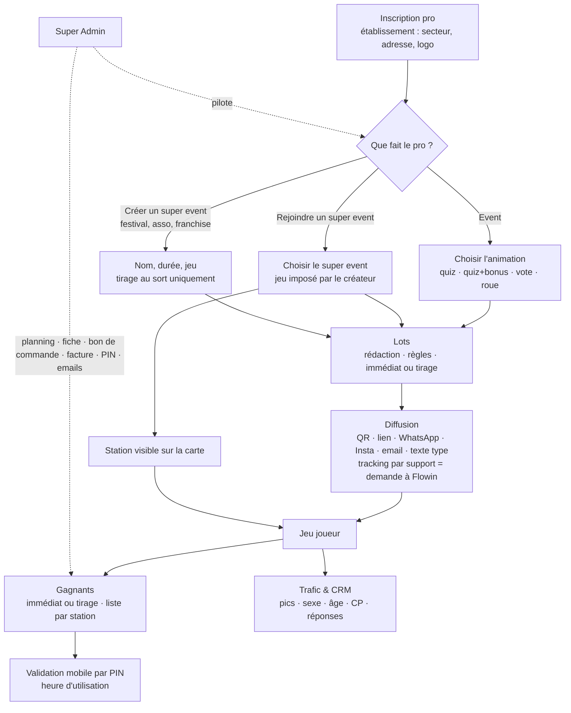

# Référentiel fonctionnel Flowin — point de référence pour audit et correction

Rédigé par Romain le 16/09/2026, rangé tel quel. **Toute correction, tout nouvel écran se mesure à ce document.**
Audit du 16/09 : section 5. Diagnostic et proposition : sections 6 et 7.

---

## 1. EVENT — le pro individuel

**Personae** : commerce, organisation, institution.

### 1.1 Inscription et gestion
- Coordonnées de l'établissement : secteur d'activité, adresse.
- Choix d'une animation : quiz · quiz + questions bonus · vote · roue (spin).

### 1.2 Gestion des lots
- Sélection ou rédaction des lots offerts + règles d'utilisation.
- Distribution : gain immédiat, ou après tirage au sort.
- Liste des gagnants et utilisation des lots (quel lot a été utilisé, à quelle heure).
- Validation des lots sur mobile par code PIN.

### 1.3 Gestion des publications
- Publication du jeu : email, WhatsApp, Instagram.
- Texte type de l'event (« nous sommes heureux de… ») + lien à cliquer.
- QR code de l'event, qui donne accès au jeu.
- QR code de tracking par support : sur demande de validation à Flowin.
- Email prérempli (lien Gmail), Mailchimp pour la multi-publication.

### 1.4 Trafic et data
- Constitution du CRM.
- Pics de fréquentation.
- Répartition sexe, âge, code postal.
- Réponses aux questions par participant + statistiques.

---

## 2. SUPER EVENT

**Personae** : festival, association de commerçants, tête de franchise, groupement.

### 2.1 Cas 1 — le pro intègre un super event
- Le pro choisit un super event et s'y inscrit.
- Le jeu est **déjà choisi en amont par le créateur** du super event ; le pro apparaît sur la carte comme station de jeu active.
- QR code de sa station, pour publier, imprimer, diffuser. Lien de tracking unique : sur demande à Flowin (onboarding).
- Lots, règles de diffusion, liste des gagnants : **comme pour un event**.
- Diffusion : **comme pour un event**. Seule différence : être visible sur la carte.
- Trafic global et par station de jeu.

### 2.2 Cas 2 — créer un super event
- Même processus que créer un event (nom, durée…).
- Choix du jeu.
- **Super event : tirage au sort uniquement.**
- Liste des gagnants regroupée par station ; email prérempli **au nom du super event**, comme pour un event.

---

## 3. SUPER ADMIN (SA)

- Créer et supprimer : pros, events, super events.
- Planning des events et super events : QR code utilisé, event / super event, date, enseigne, nom de l'event.
- Accès total aux comptes pro : contenu, trafic, infos, liste des gagnants, trafic des utilisateurs.
- Fiche complète, bon de commande et facturation **par event, super event, date**.
- Par event / super event : QR code, lots en stock, règles de diffusion, code PIN de validation, envoi d'email depuis la fiche pro.

---

## 4. Carte du fonctionnement, vue par le pro

---

## 5. Audit du 16/09 — demandé vs existant

✅ existe et fonctionne · 🟡 partiel ou défaillant · ❌ absent

### 5.1 Event (pro)

| Demandé | État | Constat |
|---|---|---|
| Inscription : secteur, adresse | 🟡 | `/pro/inscription` crée le pro ; pas de logo, site, réseaux ; `/pro/entreprise` en lecture seule ; aucune fiche commerce créée |
| Espace pro protégé | ❌ | toutes les pages `/pro` ouvrent le compte passé dans l'URL (`?pro=`), sans connexion |
| Animation quiz / quiz + bonus | 🟡 | proposées ; une seule banque, pas de banque bonus |
| Animation vote / roue | ❌ | proposées mais créées **sans contenu** (ni items de vote, ni segments de roue) |
| Lots : rédaction + règles | 🟡 | saisis ; pas de catalogue (valeur saisie perdue : **corrigé le 16/09**) |
| Distribution immédiat / tirage | ❌ | enregistrée, **jamais lue par les jeux** |
| Liste des gagnants | ✅ | par opération |
| Heure d'utilisation du lot | ❌ | seulement « remis / à remettre » |
| Validation mobile par PIN | 🟡 | `lot.html` fonctionne mais textes, logos et date « 25 octobre 2026 » NDS en dur ; pas de PIN pour un pro sans fiche commerce ; bouton « remis sans PIN » (lien « voir le billet » cassé : **corrigé le 16/09**) |
| QR de l'event | ✅ | généré localement, PNG / SVG / affiche A4 |
| WhatsApp / SMS | ✅ | |
| Email prérempli | 🟡 | seulement en fin de création, texte sans lien |
| Instagram | ❌ | |
| Texte type « nous sommes heureux… » | ❌ | |
| Mailchimp / multi-envoi | ❌ | côté pro ; export Mailchimp seulement dans le monolithe SA |
| QR de tracking sur demande | 🟡 | demande enregistrée ; seul le SA crée les QR ; les liens à usage unique ne sont lus par aucun jeu |
| CRM | 🟡 | une liste à plat, toutes opérations mélangées, 200 lignes max |
| Pics de fréquentation | ✅ | par heure et par jour |
| Sexe, âge | ✅ | camemberts |
| Code postal | ❌ | |
| Réponses par participant + stats | 🟡 | totaux sur la page station ; rien par participant |

### 5.2 Super event — cas 1 (le pro rejoint)

| Demandé | État | Constat |
|---|---|---|
| Choisir un super event et s'inscrire | 🟡 | **deux chemins concurrents** (`/pro/rejoindre` et `/rejoindre/[se]`), aucun ne crée une station active ; le second écrase une fiche pro existante |
| Jeu imposé par le créateur | ❌ | aucune notion de « jeu du super event » ; le pro ou le SA choisit |
| Visible sur la carte | 🟡 | le GPS saisi par le pro est **perdu à la validation SA** ; placement manuel |
| QR de la station | ✅ | |
| Lien de tracking unique | 🟡 | liens codés sur le module Quiz + bonus quel que soit le jeu |
| Lots, gagnants, diffusion comme un event | 🟡 | lots du super event lus dans la fiche commerce, que l'inscription ne crée pas ; lots, adresse, catégorie saisis par le pro **perdus à la validation** |
| Trafic global et par station | 🟡 | par station uniquement |

### 5.3 Super event — cas 2 (créer)

| Demandé | État | Constat |
|---|---|---|
| Créer un super event | 🟡 | SA uniquement ; **aucun parcours pour un festival / une asso / une franchise** |
| Nom, durée, jeu | ✅ | côté SA |
| Tirage au sort uniquement | ❌ | la roue et le gain immédiat restent proposés |
| Tirage du super event | 🟡 | uniquement dans `tirage-nds.html` (page hors dashboard), lot par lot, commerce par commerce |
| Gagnants groupés par station | 🟡 | groupés par commerce |
| Email au nom du super event | ❌ | textes « Nuits du Sud » en dur |
| Parcours joueur générique | 🟡 | module Quiz + bonus encore lié aux stations et textes NDS |

### 5.4 Super Admin

| Demandé | État | Constat |
|---|---|---|
| Créer / supprimer pros, events, super events | 🟡 | suppression d'un pro ou d'un event sans aucun garde-fou (events, gagnants) |
| Planning | ❌ | kanbans par statut, aucun calendrier date · enseigne · event · QR |
| Accès total au compte pro | 🟡 | fiche en 8 onglets ; pas de lien direct « ouvrir son espace » ; pas son CRM dans la fiche |
| Fiche complète | ✅ | |
| Bon de commande et facture par event / super event / date | 🟡 | super event seulement (NDS en dur) ; **rien pour un event** |
| QR par event | ✅ | |
| Stock des lots par event / super event | 🟡 | stock par commerce uniquement |
| Règles de diffusion | 🟡 | saisies côté pro seulement, jamais appliquées |
| Code PIN | 🟡 | affiché, **non modifiable** |
| Email depuis la fiche | 🟡 | liens Gmail ; aucun envoi réel côté SA |

### 5.5 Dette mesurée

| | |
|---|---|
| Pages | 78 pages Next + **60 pages HTML statiques** + monolithe `dashboard.html` (1,1 Mo) |
| Tirage des gagnants | **6 endroits** différents |
| Lots | 5 endroits · bons de commande : 6 · aperçus de parcours : 7 |
| Lots stockés dans | 3 endroits (`cfg.lots`, table `lots`, `partenaires.lots`) |
| Parcours de création / souscription | 9, sur **4 grammaires différentes** |
| Pages ou fichiers figés sur Nuits du Sud | une vingtaine (`se-nds-2026` par défaut, textes, logos) |

---

## 6. Diagnostic — trois causes

1. **Construit pour Nuits du Sud, généralisé par ajouts.** Chaque besoin générique a été greffé à côté du code NDS au lieu de le remplacer : textes, logos, identifiants NDS restent en dur.
2. **Trois couches jamais fusionnées** : monolithe, pages HTML statiques, application Next. Une fonction existe souvent deux ou trois fois, dans des états différents — d'où l'impression de perte permanente.
3. **Pas de modèle unique d'« opération ».** Les lots vivent à trois endroits, les gagnants et le PIN sont rattachés au commerce et non à l'event, le jeu n'est pas rattaché au super event. Chaque écran recalcule à sa façon, et chaque parcours d'inscription écrit ailleurs.

---

## 7. Proposition — simple, en 5 étapes

| # | Étape | Résultat |
|---|---|---|
| 1 | **Geler** : plus aucune page nouvelle. Ce référentiel fait foi. Menu réduit aux écrans du référentiel ; pages HTML NDS et monolithe retirés du menu (archivés, consultables). | un seul dashboard, une seule vérité |
| 2 | **Un modèle « opération »** : lots uniquement dans la table `lots` (par event), stock et gagnants par event, PIN par pro, jeu imposé porté par le super event, GPS sur la station. Migration des trois sources de lots. | chaque écran lit la même donnée |
| 3 | **Un seul parcours de création**, identique pro et SA, 5 étapes : Établissement → Animation (contenu inclus : questions, segments, items) → Lots (règles + immédiat / tirage) → Diffusion → Récapitulatif. Variantes : « rejoindre un super event » (jeu imposé, étapes 1-3-4-5) et « créer un super event » (tirage seul). Remplace les 9 parcours. | fin des pertes à la validation |
| 4 | **Espace pro en 6 rubriques** : Mes opérations · Lots & gagnants (+ validation PIN, heure) · Diffusion (QR, lien, WhatsApp, Insta, email, texte type, demande de tracking) · Trafic & CRM (par opération, CP, réponses) · Mon établissement (modifiable) · Contrat. Connexion obligatoire. **La fiche pro SA = les mêmes 6 rubriques**, plus planning, contrôle, bon de commande et facture par opération. | une seule grammaire |
| 5 | **Retirer Nuits du Sud du code** : textes d'email, billet `lot.html`, tirage, kit → paramétrés par l'opération ; tirage du super event dans le dashboard. | Nuits du Sud devient une opération comme les autres |
